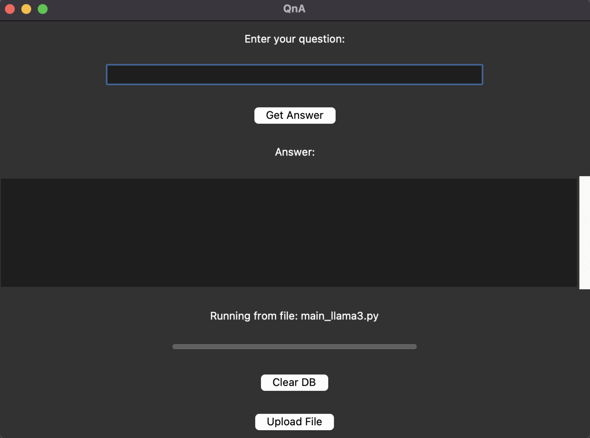
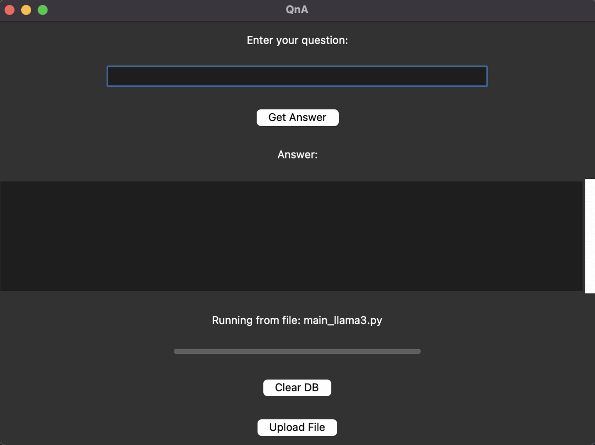

# QnA (Retrieval-Augmented Generation (RAG) Application)

This project implements a Retrieval-Augmented Generation (RAG) system using LangChain libraries. The application allows users to query a knowledge base and receive answers based on relevant document fragments retrieved from the knowledge base built from pdf input.

## Project Structure and Pipeline Overview

- `main.py`: Main entry point for querying the RAG system through the GUI.
- `start_db.py`: Script for setting up and managing the document database.
- `app.py`: GUI application for querying the RAG system and managing the document database.

1. **User Interface (GUI/Command Line)**
    - The user inputs a question via the GUI or command line.

2. **Query Handler**
    - The system processes the input query.

3. **Embedding Function (OllamaEmbeddings)**
    - The query is passed through the embedding function to generate embeddings.

4. **Chroma Database**
    - The system interacts with the Chroma database to find relevant documents based on embeddings.

5. **Contextual Retrieval**
    - Relevant document fragments are retrieved from the database and compiled as context.

6. **Prompt Creation**
    - A prompt is created using the retrieved context and the input query.

7. **Ollama Model (llama3)**
    - The Ollama model generates a response based on the prompt.

8. **Response Delivery**
    - The response is delivered back to the user via the GUI or command line.

## Setup and Installation

### Prerequisites

- Python 3.8 or higher
- Required Python packages (listed in `requirements.txt`)

### Installation

1. Clone the repository:
    ```bash
    git clone <repository_url>
    cd <repository_directory>
    ```

2. Install the required packages:
    ```bash
    pip install -r requirements.txt
    ```

## Usage

### Setting Up the Database

Before querying, the document database needs to be set up. The database is populated with documents from the `data` directory.

1. Add PDF documents to the `data` directory.
2. Run the `start_db.py` script to process and add the documents to the database:
    ```bash
    python start_db.py --reset
    ```

### Querying the System

1. Run the `main.py` script without arguments to launch the GUI:
    ```bash
    python main.py
    ```

2. Enter your question in the GUI and click "Get Answer" to receive a response.

#### Examples
As an example, a sample pdf of "The Little Prince" has been added to the database.
- Example of querying an unrelated question:
  
  

- Example of querying a related question:
  
  

### Managing the Database

The GUI application also allows you to manage the document database:

- **Upload File**: Upload new PDF documents to the `data` directory and add them to the database.
- **Clear DB**: Clear the existing document database.

## Code Overview

### `main.py`

- Defines functions to get embeddings, query the RAG system, and format responses.
- Launches the GUI application.

### `start_db.py`

- Handles document loading, text splitting, and adding documents to the database.
- Supports resetting the database.

### `app.py`

- Implements the `RAGApp` class for the GUI.
- Handles user interactions, querying, file uploads, and database management.

## Future Improvements

- Add support for additional document formats.
- Improve the GUI for better user experience.